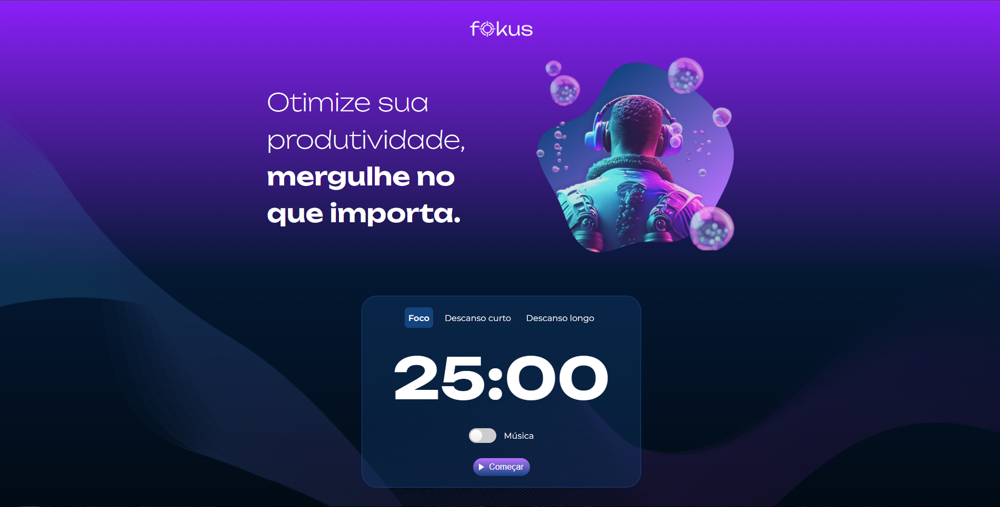
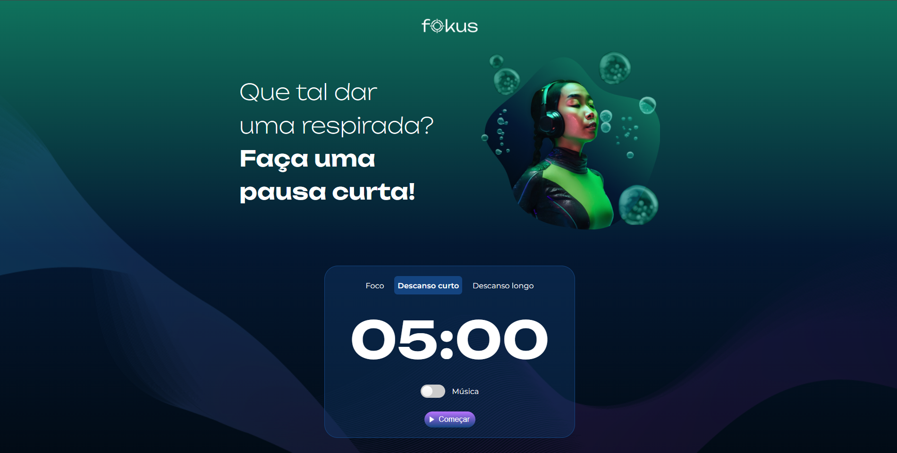
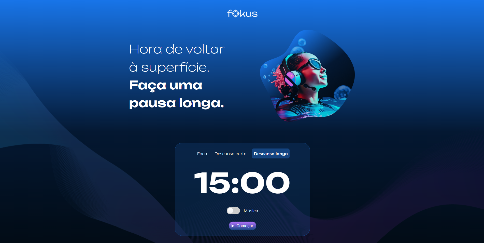

# 🎯 Fokus
Fokus é uma aplicação web simples e intuitiva desenvolvida para ajudar você a manter o foco durante momentos de trabalho, estudo ou qualquer outra atividade que exija concentração.

Este projeto simula um timer de foco baseado na técnica Pomodoro, permitindo que o usuário controle melhor seu tempo e produtividade.

## 🚀 Tecnologias Utilizadas
O projeto foi desenvolvido utilizando as seguintes tecnologias:

- HTML5 – Estrutura da página

- CSS3 – Estilização e responsividade

- JavaScript (DOM) – Lógica e interatividade, com manipulação do DOM em todo o projeto

# 📚 Base de Conhecimento
Este projeto foi desenvolvido com base nos conhecimentos adquiridos através dos cursos da plataforma Alura, sendo parte prática dos estudos de desenvolvimento web.

# 💡 Funcionalidades
Interface limpa e minimalista

Timer de foco com controle de início e pausa

Estímulo à produtividade com visual agradável

Totalmente funcional no navegador

# 📷 Preview
### Seção de Foco

### Seção de Descanso Curto

### Seção de Descanso Longo

# 🌐 Deploy
O projeto Fokus está disponível online para acesso direto, sem necessidade de instalação local.

🔗 Acesse aqui: https://projeto-fokus-ten-gamma.vercel.app/
